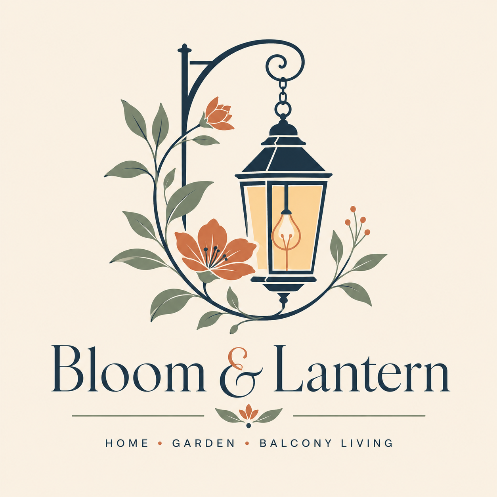

# Homepage in HTML &amp; CSS — Step-by-Step Build Guide

> Builds the **Bloom &amp; Lantern "Golden Hour" homepage** as one hand-coded HTML file with embedded CSS.
> Follow the steps top to bottom; by the end you'll have rebuilt `homepage/index.html` from scratch and understand every part.
> The finished file lives next to this guide (`homepage/index.html`) — open it in a browser any time to see the target.

This is the same page described in `homepage.md` (the Kadence version) and `Growth Strategy/kadence-theme-spec.md` (palette, fonts, header, footer). Here we build it in plain HTML + CSS — no framework, no build step, no server. Double-click the file to preview.

---

## How this guide works

- Each **STEP** adds one chunk of **HTML** (goes in `<body>`) and one chunk of **CSS** (goes in the `<style>` block in `<head>`).
- After every step, **save and refresh the browser** — you'll see that section appear. Building visibly, one section at a time, is the whole point.
- **Why** notes explain the choice so you can change things confidently later.
- House rules carried over: no em-dashes, no emoji, no arrows in on-page copy; one H1 only (the hero); WCAG-AA contrast.

### Mental model: how the build maps to Kadence
If you later rebuild this in WordPress, the mapping is 1:1:

| Here (HTML) | In WordPress |
|---|---|
| `<section>` | one Kadence **Row Layout** block |
| `<a class="...card">` wrapping content | an **Info Box** with "Apply link to entire box" ON |
| `:root` CSS variables | the palette in **Customize → Colors** + Additional CSS |
| STEP 0 header / STEP 7 footer | the **theme** Header/Footer (site-wide, not the homepage) |
| STEP 6 post cards | the core **Query Loop** block (dynamic) |

---

## STEP 0a — The empty page scaffold

Create a file `index.html` and paste this skeleton. Everything else in this guide goes **inside** the two marked slots.

```html
<!DOCTYPE html>
<html lang="en">
<head>
  <meta charset="UTF-8" />
  <meta name="viewport" content="width=device-width, initial-scale=1.0" />
  <title>Bloom &amp; Lantern — Small Balcony &amp; Patio Styling</title>
  <meta name="description" content="Renter-friendly decor, furniture, privacy, garden, and lighting ideas for small balconies and patios." />
  <link rel="icon" href="../assets/favicon/favicon.png" />

  <!-- Fonts: Playfair Display (headings) + Montserrat (body/UI) -->
  <link rel="preconnect" href="https://fonts.googleapis.com" />
  <link rel="preconnect" href="https://fonts.gstatic.com" crossorigin />
  <link href="https://fonts.googleapis.com/css2?family=Montserrat:wght@400;500;600&family=Playfair+Display:wght@600;700&display=swap" rel="stylesheet" />

  <style>
    /* >>> ALL CSS FROM EACH STEP GOES HERE <<< */
  </style>
</head>
<body>
  <!-- >>> ALL HTML FROM EACH STEP GOES HERE <<< -->
</body>
</html>
```

**Why these lines:**
- `<meta name="viewport">` is what makes the page respond to phone width. Without it, mobile browsers pretend to be 980px wide and your media queries never fire.
- The `<link>` to Google Fonts loads only the **weights you use** (Montserrat 400/500/600, Playfair 600/700). Loading whole families is slower; this matches the theme spec's "don't load the full families."
- `preconnect` warms up the font server connection a beat early, so text doesn't flash.
- We work in **one file with one `<style>` block** on purpose: it's the easiest thing to open, read, and later copy into WordPress's Additional CSS.

---

## STEP 0b — Design tokens + base styles

This is the foundation: brand colors as variables, a tiny reset, and the default look of headings, body text, buttons, and layout helpers. **Paste this first, before any other CSS.** Nothing renders dramatically yet, but every later step depends on it.

```css
/* ---------- Design tokens (one source of truth for color + type) ---------- */
:root{
  --terracotta:#C97B5A;     --terracotta-dark:#A85F42;
  --heading:#2E2B27;        --body:#3A3A38;        --muted:#6B655C;
  --border:#E4D6BF;         --subtle-bg:#EFE3D1;   --cream:#F5EBDD;
  --dusk:#2C3E50;           --sage:#9CAF88;        --honey:#C8A06A;
  --amber:#E8B86D;          --surface:#FFFDF8;     --btn-text:#FFF8EF;

  --font-display:"Playfair Display", Georgia, serif;
  --font-body:"Montserrat", system-ui, -apple-system, sans-serif;

  --max:1080px; --radius:10px; --section-pad:80px;
}

/* ---------- Reset + base ---------- */
*,*::before,*::after{ box-sizing:border-box; }
html{ scroll-behavior:smooth; }
body{
  margin:0; font-family:var(--font-body); font-weight:400;
  font-size:17px; line-height:1.75; color:var(--body); background:var(--cream);
  -webkit-font-smoothing:antialiased;
}
img{ max-width:100%; display:block; }

h1,h2,h3{ font-family:var(--font-display); color:var(--heading); margin:0 0 .4em; }
h1{ font-weight:700; font-size:44px; line-height:1.15; letter-spacing:-.01em; }
h2{ font-weight:700; font-size:32px; line-height:1.2;  letter-spacing:-.005em; }
h3{ font-weight:600; font-size:24px; line-height:1.3; }
p{ margin:0 0 1em; }

/* ---------- Layout helpers ---------- */
.container{ width:100%; max-width:var(--max); margin-inline:auto; padding-inline:24px; }
.section{ padding-block:var(--section-pad); }
.bg-cream{ background:var(--cream); } .bg-surface{ background:var(--surface); } .bg-subtle{ background:var(--subtle-bg); }

.eyebrow{
  font-family:var(--font-body); text-transform:uppercase; letter-spacing:.12em;
  font-size:.78rem; font-weight:600; color:var(--terracotta-dark); margin:0 0 .5em;
}
.section-head{ text-align:center; max-width:680px; margin:0 auto 48px; }
.section-head p{ color:var(--muted); margin:0; }

/* ---------- Buttons (with the amber "lantern glow" on hover) ---------- */
.btn{
  display:inline-block; font-family:var(--font-body); font-weight:600; font-size:15px;
  text-transform:uppercase; letter-spacing:.05em; text-decoration:none;
  padding:14px 28px; border-radius:6px; border:2px solid transparent; cursor:pointer;
  transition:background-color .2s, color .2s, box-shadow .25s, transform .15s;
}
.btn--primary{ background:var(--terracotta); color:var(--btn-text); border-color:var(--terracotta); }
.btn--primary:hover{ background:var(--terracotta-dark); border-color:var(--terracotta-dark); }
.btn--outline{ background:transparent; color:var(--terracotta-dark); border-color:var(--terracotta-dark); }
.btn--outline:hover{ background:var(--terracotta); color:var(--btn-text); border-color:var(--terracotta); }
.btn:hover{ box-shadow:0 6px 22px -6px rgba(201,123,90,.65), 0 0 0 3px rgba(232,184,109,.30); transform:translateY(-1px); }

/* ---------- Temporary image placeholder (delete when real photos are in) ---------- */
.ph{
  position:relative; display:grid; place-items:center; text-align:center; padding:1rem;
  background:linear-gradient(135deg,#E8B86D 0%, #C97B5A 45%, #2C3E50 100%);
  color:#fff; font-family:var(--font-body); font-size:.72rem; letter-spacing:.04em; text-transform:uppercase;
}
.ph span{ background:rgba(0,0,0,.28); padding:.3em .6em; border-radius:4px; }
```

**Why this matters most:**
- **Tokens (`:root`)** mean a color is named once. Want a deeper terracotta everywhere? Change `--terracotta`. This mirrors the theme spec exactly, so the static page and the WordPress site stay in sync.
- **`box-sizing:border-box`** on everything makes width math sane: padding no longer adds to an element's declared width. This single line prevents most "why is my layout 16px too wide" headaches.
- **`.container`** (max 1080px, centered, 24px side padding) is reused by every section, so text never stretches uncomfortably wide on a big monitor. The spec calls for exactly this 1080px content width.
- **`.btn:hover`** is the brand signature: a warm shadow plus a soft amber ring, the "lantern warming up." `transform:translateY(-1px)` lifts it a hair so it feels physical.
- **`.ph`** is scaffolding. It draws a golden-hour gradient box wherever a real photo will go, so the layout looks finished before you've generated images. You delete it later.

---

## STEP 0c — Header (sticky nav)

In WordPress this comes from the theme, not the homepage. Here we add it so the page reads like a real site.

**HTML** (top of `<body>`):
```html
<header class="site-header">
  <div class="container">
    <a class="brand" href="/">
      
      <span class="wordmark">Bloom &amp; Lantern</span>
    </a>
    <nav class="nav" aria-label="Primary">
      <a href="/small-balcony-patio-ideas">Balcony Ideas</a>
      <a href="/small-patio-ideas">Patio Ideas</a>
      <a href="/balcony-garden-ideas">Garden</a>
      <a href="/about">About</a>
    </nav>
    <button class="nav-toggle" aria-label="Open menu"><span></span><span></span><span></span></button>
  </div>
</header>
```

**CSS:**
```css
.site-header{ position:sticky; top:0; z-index:50; background:var(--cream); border-bottom:1px solid var(--border); }
.site-header .container{ display:flex; align-items:center; justify-content:space-between; padding-block:14px; }
.brand{ display:flex; align-items:center; gap:10px; text-decoration:none; }
.brand img{ height:40px; width:auto; }
.brand .wordmark{ font-family:var(--font-display); font-weight:700; font-size:24px; color:var(--heading); }
.nav{ display:flex; gap:26px; align-items:center; }
.nav a{ font-family:var(--font-body); font-weight:500; font-size:15px; color:var(--body); text-decoration:none; position:relative; padding-block:4px; }
.nav a:hover{ color:var(--terracotta); }
.nav a::after{ content:""; position:absolute; left:0; bottom:0; height:2px; width:0; background:var(--amber); transition:width .2s; }
.nav a:hover::after{ width:100%; }
.nav-toggle{ display:none; background:none; border:0; cursor:pointer; padding:8px; }
.nav-toggle span{ display:block; width:24px; height:2px; background:var(--heading); margin:5px 0; }
```

**Why:**
- **`position:sticky; top:0`** keeps the nav pinned as you scroll, so the hubs are always one tap away. `z-index:50` keeps it above the hero.
- **`display:flex; justify-content:space-between`** is the classic "logo left, nav right" pattern: two children pushed to opposite ends of the bar.
- The **`::after` pseudo-element** is the amber underline. It starts at `width:0` and animates to `100%` on hover, so the underline appears to "draw in." No extra HTML needed.
- The **`.nav-toggle`** (hamburger) is `display:none` now; STEP 8 reveals it on phones where the full nav is hidden.

---

## STEP 1 — Hero

The page's single most important glance: image, headline, two buttons into the hubs. The text sits in a cream "band" over the lower part of the image (mirrors your Aesthetic Hero pins).

**HTML** (after the header):
```html
<main>
<section class="hero">
  <div class="container">
    <div class="hero__band">
      <p class="eyebrow">Small Balcony &amp; Patio Styling</p>
      <h1>Make the most of your small balcony or patio</h1>
      <p class="subhead">Renter-friendly decor, furniture, privacy, garden, and lighting ideas for the small space you already have. No backyard, no drills, no overspending.</p>
      <div class="hero__actions">
        <a class="btn btn--primary" href="/small-balcony-patio-ideas">Explore Balcony Ideas</a>
        <a class="btn btn--outline" href="/small-patio-ideas">Explore Patio Ideas</a>
      </div>
    </div>
  </div>
</section>
```

**CSS:**
```css
.hero{
  position:relative; min-height:75vh; display:flex; align-items:flex-end;
  /* SWAP: replace this gradient with your hero photo:
     background-image:url('hero.jpg'); */
  background:linear-gradient(120deg,#E8B86D 0%, #C8A06A 30%, #C97B5A 60%, #2C3E50 100%);
  background-size:cover; background-position:center;
}
.hero::before{ content:""; position:absolute; inset:0;
  background:linear-gradient(180deg, rgba(44,62,80,0) 35%, rgba(44,62,80,.45) 100%); }
.hero .container{ position:relative; z-index:1; padding-bottom:56px; }
.hero__band{
  background:rgba(245,235,221,.94); border-radius:var(--radius); padding:32px;
  max-width:620px; box-shadow:0 10px 30px rgba(0,0,0,.12);
}
.hero__band .subhead{ font-size:18px; color:var(--body); margin-bottom:1.4em; }
.hero__actions{ display:flex; gap:12px; flex-wrap:wrap; }
```

**Why:**
- **`min-height:75vh`** makes the hero 75% of the screen's height — big and immersive, but never taller than the viewport. `vh` = "viewport height."
- **`display:flex; align-items:flex-end`** drops the band to the **bottom** of the hero, leaving the calm upper area of the photo visible.
- **`.hero::before` overlay** is a gradient from transparent (top) to 45% dusk-blue (bottom). It darkens only the lower third, so the cream band and text stay legible no matter what the photo looks like. This is why the band is readable over any image.
- **`rgba(245,235,221,.94)`** is the cream band at 94% opacity — a hint of the photo shows through, so it feels layered, not pasted on. (We use the literal color here because CSS can't drop a `--variable` into `rgba()` cleanly.)
- **`flex-wrap:wrap`** on the buttons lets them stack on narrow screens instead of overflowing.

---

## STEP 2 — Start with your space (two cards)

Route the visitor instantly: are they up on a balcony, or down on a patio? Two big, fully clickable cards.

**HTML:**
```html
<section class="section bg-cream">
  <div class="container">
    <div class="section-head"><h2>Start with your space</h2></div>
    <div class="cards-2">

      <a class="space-card space-card--balcony" href="/small-balcony-patio-ideas">
        <div class="ph"><span>Balcony card image</span></div>
        <div class="pad">
          <h3>Balcony Ideas</h3>
          <p>Up high on a railing? Style a cozy, modern, or boho balcony that works in inches, not acres.</p>
          <span class="card-link">Browse balcony ideas</span>
        </div>
      </a>

      <a class="space-card space-card--patio" href="/small-patio-ideas">
        <div class="ph"><span>Patio card image</span></div>
        <div class="pad">
          <h3>Patio Ideas</h3>
          <p>Down at ground level? Turn a bare slab or tight patio into a full outdoor room you actually use.</p>
          <span class="card-link">Browse patio ideas</span>
        </div>
      </a>

    </div>
  </div>
</section>
```

**CSS:**
```css
.cards-2{ display:grid; grid-template-columns:1fr 1fr; gap:24px; }
.space-card{
  display:block; text-decoration:none; color:inherit;
  border:1px solid var(--border); border-radius:var(--radius); overflow:hidden;
  transition:transform .18s, box-shadow .25s;
}
.space-card:hover{ transform:translateY(-2px); box-shadow:0 12px 28px -10px rgba(46,43,39,.28); }
.space-card .ph{ aspect-ratio:3/2; }
.space-card .pad{ padding:28px; }
.space-card--balcony .pad{ background:rgba(200,160,106,.14); } /* honey tint */
.space-card--patio   .pad{ background:rgba(156,175,136,.16); } /* sage tint  */
.space-card p{ color:var(--body); margin-bottom:.8em; }
.card-link{ font-family:var(--font-body); font-weight:600; color:var(--terracotta-dark); }
```

**Why:**
- **The whole card is an `<a>`.** That's the entire "make the box clickable" idea: wrap the content in a link, set `color:inherit` and `text-decoration:none` so it doesn't look like a blue link, and the full card becomes one big tap target. (`color:inherit` says "use the surrounding text color, not the default link color.")
- **`display:grid; grid-template-columns:1fr 1fr`** makes two equal columns. `1fr` = "one fraction of the free space," so the two cards always split the row evenly, with `gap:24px` between.
- **`aspect-ratio:3/2`** locks the image area to a 3:2 shape so both cards line up regardless of the actual photo. No manual height needed.
- **`overflow:hidden`** on the card clips the image to the rounded corners.
- The **balcony/patio tints** (honey, sage) are the only visual difference between the two cards, gently coding each to its space.

---

## STEP 3 — Start here (four curated guides)

Hand a first-time visitor your four strongest entry points: the two hubs, the biggest-volume post, and the money post.

**HTML:**
```html
<section class="section bg-surface">
  <div class="container">
    <div class="section-head">
      <p class="eyebrow">Start Here</p>
      <h2>New here? Start with these</h2>
    </div>
    <div class="cards-4">
      <a class="guide-card" href="/small-balcony-patio-ideas">
        <div class="ph"><span>Featured image</span></div>
        <div class="pad"><h3>Small Balcony Ideas</h3><p>The complete small-balcony playbook, in one guide.</p></div>
      </a>
      <a class="guide-card" href="/small-patio-ideas">
        <div class="ph"><span>Featured image</span></div>
        <div class="pad"><h3>Small Patio Ideas</h3><p>Thirty ways to style a tiny patio or slab.</p></div>
      </a>
      <a class="guide-card" href="/balcony-garden-ideas">
        <div class="ph"><span>Featured image</span></div>
        <div class="pad"><h3>Balcony Garden Ideas</h3><p>Grow a lush container garden on a railing.</p></div>
      </a>
      <a class="guide-card" href="/patio-furniture-ideas">
        <div class="ph"><span>Featured image</span></div>
        <div class="pad"><h3>Best Small-Patio Furniture</h3><p>Seating that fits where it seems impossible.</p></div>
      </a>
    </div>
  </div>
</section>
```

**CSS:**
```css
.cards-4{ display:grid; grid-template-columns:repeat(4,1fr); gap:24px; }
.guide-card{
  display:block; text-decoration:none; color:inherit; background:var(--surface);
  border:1px solid var(--border); border-radius:var(--radius); overflow:hidden;
  transition:transform .18s, box-shadow .25s;
}
.guide-card:hover{ transform:translateY(-2px); box-shadow:0 12px 28px -10px rgba(46,43,39,.28); }
.guide-card .ph{ aspect-ratio:3/2; }
.guide-card .pad{ padding:20px; }
.guide-card h3{ font-size:18px; margin-bottom:.3em; }
.guide-card p{ font-size:15px; color:var(--muted); margin:0; }
```

**Why:**
- **`repeat(4,1fr)`** is shorthand for "four equal columns" — same as typing `1fr 1fr 1fr 1fr`. Handy as column counts grow.
- This section uses **`bg-surface` (`#FFFDF8`)** instead of cream, a barely-there lift off the surrounding cream sections. That subtle alternation is what gives the page rhythm without hard color changes.
- Same clickable-card pattern as STEP 2, reused. Once you understand one card grid, you understand all of them.

---

## STEP 4 — Find your project (six icon tiles)

Let visitors self-route by the six things you cover, regardless of balcony vs patio. Small icon tiles, three across.

**HTML** (icons are inline SVG so they inherit the terracotta color and need no image files):
```html
<section class="section bg-cream">
  <div class="container">
    <div class="section-head">
      <h2>Find your project</h2>
      <p>Six things to sort out for any small outdoor space. Tap the one you're working on.</p>
    </div>
    <div class="tiles-6">
      <a class="tile" href="/small-balcony-patio-ideas">
        <svg viewBox="0 0 24 24" fill="none" stroke="currentColor" stroke-width="1.7" stroke-linecap="round" stroke-linejoin="round"><circle cx="13.5" cy="6.5" r=".5"/><circle cx="17.5" cy="10.5" r=".5"/><circle cx="8.5" cy="7.5" r=".5"/><circle cx="6.5" cy="12.5" r=".5"/><path d="M12 2C6.5 2 2 6.5 2 12s4.5 10 10 10c.926 0 1.648-.746 1.648-1.688 0-.437-.18-.835-.437-1.125-.29-.289-.438-.652-.438-1.125a1.64 1.64 0 0 1 1.668-1.668h1.996c3.051 0 5.555-2.503 5.555-5.554C21.965 6.012 17.461 2 12 2z"/></svg>
        <span class="label">Decor &amp; Styling</span>
      </a>
      <a class="tile" href="/patio-furniture-ideas">
        <svg viewBox="0 0 24 24" fill="none" stroke="currentColor" stroke-width="1.7" stroke-linecap="round" stroke-linejoin="round"><path d="M5 11V6a2 2 0 0 1 2-2h10a2 2 0 0 1 2 2v5"/><path d="M3 11h18a1 1 0 0 1 1 1v4H2v-4a1 1 0 0 1 1-1z"/><path d="M5 16v3M19 16v3"/></svg>
        <span class="label">Furniture &amp; Seating</span>
      </a>
      <a class="tile" href="/balcony-privacy-ideas-for-apartments">
        <svg viewBox="0 0 24 24" fill="none" stroke="currentColor" stroke-width="1.7" stroke-linecap="round" stroke-linejoin="round"><path d="M12 2 4 5v6c0 5 3.5 8.5 8 11 4.5-2.5 8-6 8-11V5l-8-3z"/></svg>
        <span class="label">Privacy &amp; Shade</span>
      </a>
      <a class="tile" href="/balcony-garden-ideas">
        <svg viewBox="0 0 24 24" fill="none" stroke="currentColor" stroke-width="1.7" stroke-linecap="round" stroke-linejoin="round"><path d="M11 20A7 7 0 0 1 4 13c4 0 7 3 7 7z"/><path d="M13 20a7 7 0 0 1 7-7c0 4-3 7-7 7z"/><path d="M12 20V9"/><path d="M12 9C12 5 9 3 6 3c0 3 2 6 6 6z"/></svg>
        <span class="label">Garden &amp; Plants</span>
      </a>
      <a class="tile" href="/balcony-flooring-ideas">
        <svg viewBox="0 0 24 24" fill="none" stroke="currentColor" stroke-width="1.7" stroke-linecap="round" stroke-linejoin="round"><rect x="3" y="3" width="18" height="18" rx="1"/><path d="M3 9h18M3 15h18M9 3v18M15 3v18"/></svg>
        <span class="label">Flooring</span>
      </a>
      <a class="tile" href="/balcony-lighting-ideas">
        <svg viewBox="0 0 24 24" fill="none" stroke="currentColor" stroke-width="1.7" stroke-linecap="round" stroke-linejoin="round"><path d="M9 18h6M10 21h4"/><path d="M12 2a7 7 0 0 0-4 12.7c.6.5 1 1.3 1 2.1V18h6v-1.2c0-.8.4-1.6 1-2.1A7 7 0 0 0 12 2z"/></svg>
        <span class="label">Lighting</span>
      </a>
    </div>
  </div>
</section>
```

**CSS:**
```css
.tiles-6{ display:grid; grid-template-columns:repeat(3,1fr); gap:24px; }
.tile{
  display:flex; flex-direction:column; align-items:center; text-align:center;
  text-decoration:none; color:inherit; background:var(--surface);
  border:1px solid var(--border); border-radius:var(--radius); padding:28px 24px;
  transition:transform .18s, box-shadow .25s;
}
.tile:hover{ transform:translateY(-2px); box-shadow:0 12px 28px -10px rgba(46,43,39,.28); }
.tile svg{ width:36px; height:36px; color:var(--terracotta); margin-bottom:14px; transition:color .2s; }
.tile:hover svg{ color:var(--terracotta-dark); }
.tile .label{ font-family:var(--font-body); font-weight:600; font-size:16px; color:var(--heading); }
```

**Why:**
- **Inline SVG icons** beat image files here: they're sharp at any size, weigh almost nothing, and — crucially — `stroke="currentColor"` makes them adopt whatever text `color` the tile has. That's why `color:var(--terracotta)` on `.tile svg` colors the icon, and the hover swaps it to the darker terracotta with no separate icon swap.
- **`flex-direction:column; align-items:center`** stacks the icon above the label and centers both.
- Six tiles in a `repeat(3,1fr)` grid naturally flow into **3 across × 2 rows** — the grid wraps automatically once three fill a row.
- In WordPress these become Info Boxes with Kadence's free icon library; the link targets are identical.

---

## STEP 5 — About teaser

A warm, trust-building line about who this is for. Also helps Google E-E-A-T and ad-network review. Two columns: image beside text.

**HTML:**
```html
<section class="section bg-subtle">
  <div class="container">
    <div class="about">
      <div class="ph"><span>About image</span></div>
      <div>
        <p class="eyebrow">Our Story</p>
        <h2>Small space, big potential</h2>
        <p>You have a small balcony or patio, a limited budget, and probably a lease that says "no permanent changes." Bloom &amp; Lantern is built for exactly that. We turn tight outdoor spaces into corners you actually want to sit in, with clear, renter-friendly ideas you can copy this weekend.</p>
        <a class="btn btn--outline" href="/about">About Bloom &amp; Lantern</a>
      </div>
    </div>
  </div>
</section>
```

**CSS:**
```css
.about{ display:grid; grid-template-columns:45% 1fr; gap:40px; align-items:center; }
.about .ph{ aspect-ratio:4/3; border-radius:var(--radius); }
.about h2{ margin-bottom:.4em; }
.about p{ color:var(--body); }
```

**Why:**
- **`grid-template-columns:45% 1fr`** gives the image 45% of the width and lets the text take the remaining space (`1fr` = "whatever's left"). The spec's ~45/55 split, exactly.
- **`align-items:center`** vertically centers the text against the image so a short paragraph doesn't float at the top.
- This section uses **`bg-subtle` (`#EFE3D1`)**, the deepest cream, to set the About apart from its neighbors — the one noticeably different band on the page.

---

## STEP 6 — Latest from the blog

Show the site is active. In WordPress this is a dynamic **Query Loop** (newest 6 posts). In static HTML we hard-code representative cards so you can see and style the grid; swap them for the Query Loop when you build in WP.

**HTML:**
```html
<section class="section bg-cream">
  <div class="container">
    <div class="section-head"><h2>Latest from the blog</h2></div>
    <div class="posts-3">
      <a class="post-card" href="/small-patio-ideas">
        <div class="ph"><span>Post image</span></div>
        <div class="pad"><span class="cat">Patio Ideas</span><h3>30 Small Patio Ideas That Actually Fit</h3></div>
      </a>
      <!-- repeat the .post-card block for each of your newest posts (aim for 6) -->
    </div>
    <div class="center"><a class="btn btn--outline" href="/blog">View all guides</a></div>
  </div>
</section>
</main>
```
(See `index.html` for all six filled-in cards.)

**CSS:**
```css
.posts-3{ display:grid; grid-template-columns:repeat(3,1fr); gap:24px; }
.post-card{
  display:block; text-decoration:none; color:inherit; background:var(--surface);
  border:1px solid var(--border); border-radius:var(--radius); overflow:hidden;
  transition:transform .18s, box-shadow .25s;
}
.post-card:hover{ transform:translateY(-2px); box-shadow:0 12px 28px -10px rgba(46,43,39,.28); }
.post-card .ph{ aspect-ratio:3/2; }
.post-card .pad{ padding:16px 18px 20px; }
.post-card .cat{ font-family:var(--font-body); font-weight:600; text-transform:uppercase; letter-spacing:.06em; font-size:12px; color:var(--terracotta-dark); }
.post-card h3{ font-size:20px; margin:.3em 0 0; }
.center{ text-align:center; margin-top:40px; }
```

**Why:**
- The **`.cat` eyebrow** (category in small terracotta caps) above each title is the same label rhythm as the page's eyebrows — it ties the post cards into the brand system.
- **When you move to WordPress:** delete these six `<a>` blocks and drop in a Query Loop set to *Inherit OFF, Post type = Posts, Order by Date, 6 items, 3-column grid.* The CSS classes won't carry over (Kadence generates its own), but the **layout and intent are identical**, so this is your visual target.

---

## STEP 7 — Footer

Site-wide in WordPress (theme spec §4). The dusk-blue footer is the brand's signature "evening" close. Three link columns plus a bottom bar.

**HTML** (after `</main>`):
```html
<footer class="site-footer">
  <div class="container">
    <div class="footer-cols">
      <div>
        <p class="wordmark">Bloom &amp; Lantern</p>
        <p>Small-space balcony &amp; patio styling, decor, and container gardening.</p>
      </div>
      <div>
        <h4>Explore</h4>
        <ul>
          <li><a href="/small-balcony-patio-ideas">Balcony Ideas</a></li>
          <li><a href="/small-patio-ideas">Patio Ideas</a></li>
        </ul>
      </div>
      <div>
        <h4>Site</h4>
        <ul>
          <li><a href="/about">About</a></li>
          <li><a href="/contact">Contact</a></li>
          <li><a href="/privacy-policy">Privacy Policy</a></li>
          <li><a href="/affiliate-disclosure">Affiliate Disclosure</a></li>
        </ul>
      </div>
    </div>
    <div class="footer-bar">
      <span>&copy; Bloom &amp; Lantern</span>
      <span>Built for small balconies and patios.</span>
    </div>
  </div>
</footer>
```

**CSS:**
```css
.site-footer{ background:var(--dusk); color:var(--cream); padding-block:56px 0; }
.footer-cols{ display:grid; grid-template-columns:1.4fr 1fr 1fr; gap:40px; }
.site-footer h4{ font-family:var(--font-body); font-weight:600; text-transform:uppercase; letter-spacing:.08em; font-size:.9rem; color:var(--amber); margin:0 0 1em; }
.site-footer .wordmark{ font-family:var(--font-display); font-weight:700; font-size:22px; color:var(--cream); }
.site-footer p{ color:rgba(245,235,221,.85); font-size:15px; }
.site-footer ul{ list-style:none; margin:0; padding:0; }
.site-footer li{ margin-bottom:.6em; }
.site-footer a{ color:var(--cream); text-decoration:none; transition:color .2s; }
.site-footer a:hover{ color:var(--amber); }
.footer-bar{ margin-top:48px; border-top:1px solid rgba(245,235,221,.18); padding-block:20px; font-size:13px; color:rgba(245,235,221,.7); display:flex; justify-content:space-between; flex-wrap:wrap; gap:12px; }
```

**Why:**
- **`background:var(--dusk)` with `color:var(--cream)`** is the deliberate inversion: cream text on dusk-blue. Both clear WCAG AA contrast, and the dark band signals "end of page."
- **Column headings in amber caps** (`color:var(--amber)`) are the warm accent against the dark — the "lantern" glow, picked up again at the bottom of the page.
- **`grid-template-columns:1.4fr 1fr 1fr`** gives the brand column a bit more room (1.4 parts) than the two link columns (1 part each).

---

## STEP 8 — Make it responsive

Everything so far is the desktop layout. These media queries reshape it for tablet and phone. **Paste at the very end of the CSS** so they override the earlier rules.

```css
/* Tablet */
@media (max-width:900px){
  :root{ --section-pad:56px; }
  h1{ font-size:34px; } h2{ font-size:27px; }
  .cards-4{ grid-template-columns:1fr 1fr; }   /* 4 -> 2 */
  .posts-3{ grid-template-columns:1fr 1fr; }   /* 3 -> 2 */
  .about{ grid-template-columns:1fr; }         /* image stacks above text */
  .footer-cols{ grid-template-columns:1fr 1fr; }
}
/* Phone */
@media (max-width:600px){
  :root{ --section-pad:48px; }
  h1{ font-size:28px; }
  .nav{ display:none; } .nav-toggle{ display:block; }  /* swap nav for hamburger */
  .cards-2{ grid-template-columns:1fr; }       /* 1-up */
  .cards-4{ grid-template-columns:1fr; }
  .tiles-6{ grid-template-columns:1fr 1fr; }   /* tiles stay 2-up */
  .posts-3{ grid-template-columns:1fr; }
  .footer-cols{ grid-template-columns:1fr; }
  .hero__band{ padding:24px; }
  .hero__actions .btn{ flex:1 1 100%; text-align:center; }  /* buttons stack full-width */
}
/* Accessibility: honor "reduce motion" OS setting */
@media (prefers-reduced-motion:reduce){
  *{ transition:none !important; scroll-behavior:auto !important; }
}
```

**Why:**
- **`@media (max-width:900px)`** means "apply these rules only when the screen is 900px wide or less." Because they come last, they win over the desktop rules (later CSS overrides earlier when specificity ties). This is "mobile adaptation by override."
- We mostly just **change `grid-template-columns`** per breakpoint: 4→2→1, 3→2→1. The grid does the rest of the work; we never reposition anything by hand.
- **The hamburger swap:** hide `.nav`, show `.nav-toggle`. (Making the button actually open a menu needs a few lines of JavaScript — out of scope for a CSS guide, and unnecessary in WordPress, where Kadence's mobile menu is built in.)
- **`prefers-reduced-motion`** switches off the lift/glow transitions for users who've asked their OS to reduce motion. A small courtesy that also satisfies the accessibility floor in both specs.

---

## STEP 9 — Swap in real images

Until you generate the four photos (prompts in `homepage.md`, Appendix A), every `.ph` shows a gradient placeholder. To use a real image, do **one** of these per spot:

- **Background images** (hero): in the CSS, replace the gradient on `.hero` with
  `background-image:url('hero.jpg');` and delete the placeholder gradient line.
- **Card/section images** (everywhere else): replace the `<div class="ph">…</div>` with a real tag, e.g.
  ``.
  Keep the `aspect-ratio` rule on its container so the layout doesn't jump.

Then delete the `.ph` CSS block once no placeholders remain.

**Always write a real `alt`** describing the photo (not "image"): screen readers read it aloud, and Google uses it. Keep them specific and honest.

**Compress before uploading** (a free WebP/JPEG optimizer). The hero especially: a heavy hero image is the most common thing that makes a homepage feel slow.

---

## Final checklist

- [ ] Sections alternate backgrounds: cream → cream → surface → cream → deep-cream → cream.
- [ ] Only **one `<h1>`** on the page (the hero). Everything else is `<h2>`/`<h3>`.
- [ ] Every link points somewhere real (or a planned slug).
- [ ] Resize the browser narrow: grids collapse, nav becomes a hamburger, hero buttons stack.
- [ ] No em-dashes, emoji, or literal arrows in the visible copy.
- [ ] Real `alt` text on every image once photos are in.
- [ ] Hero image compressed; placeholders removed.

When you rebuild in WordPress, this file is your **pixel reference**: keep it open beside the Kadence editor and match section by section.
```
